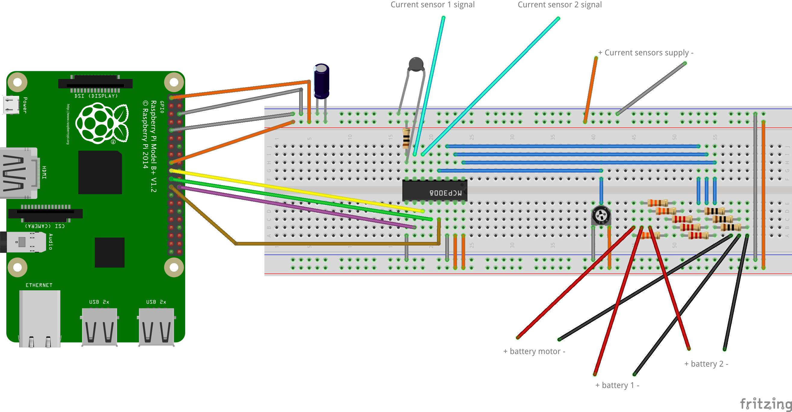
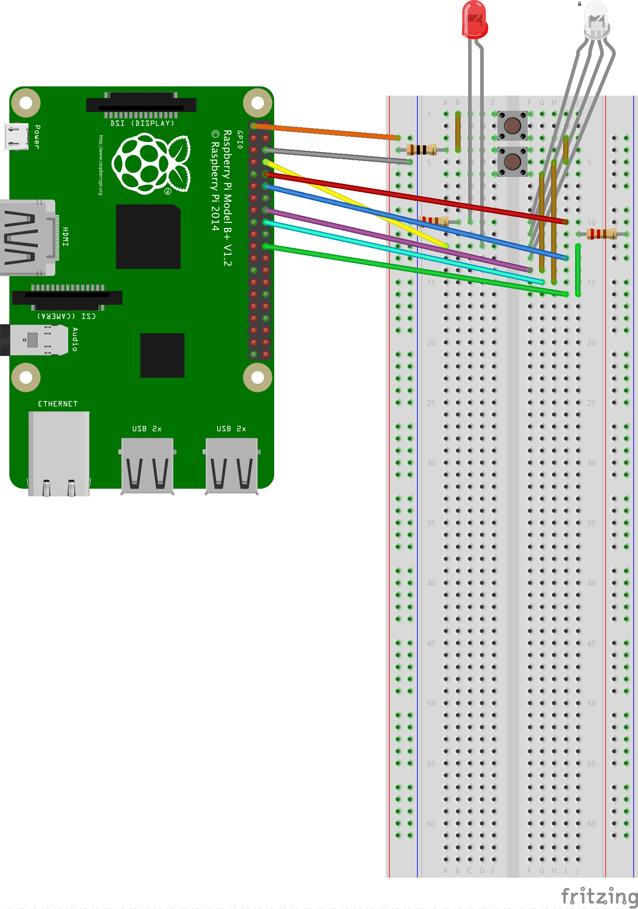
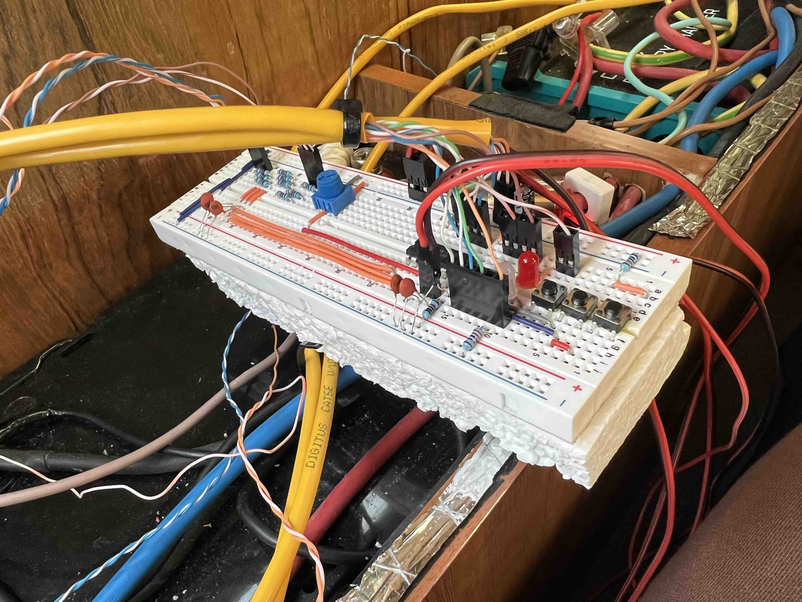
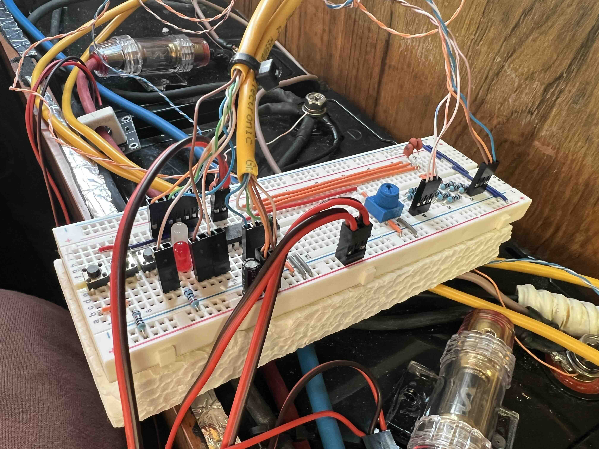
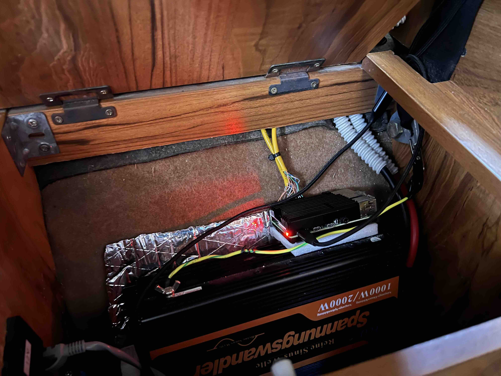
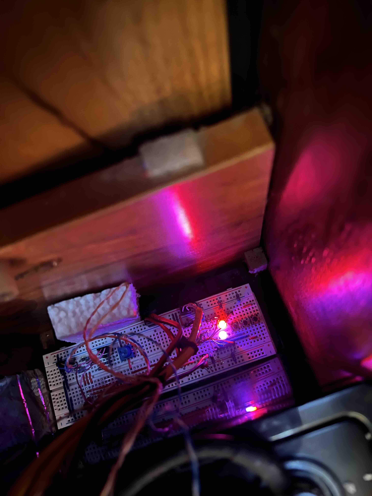
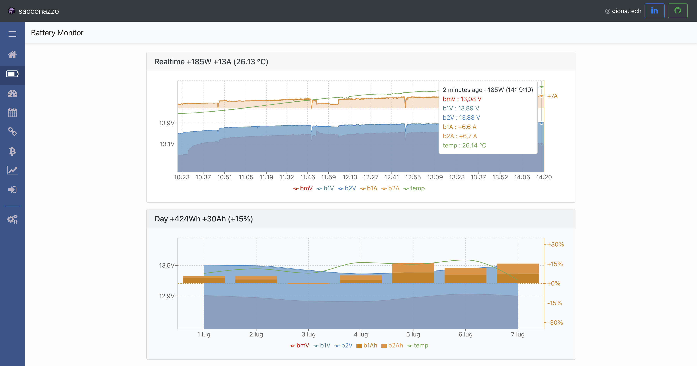

# GPIO RPI4 manager for van battery stats

## Prerequisites

### Hardware:

- RPI4
- Breadboard and connectors
- Analog Voltage sensor (it is possible to build it by yourself creating a voltage divider with some resistors)
- Analog Current sensor (ACS758 o WCS1700)
- Analog potentiometer
- ADC converter (MCP3008)
- Some leds and resistors (optional)
- Some physical buttons (optional)

### Software

- Pi OS (10 or later)
- MySQL server 8 installed (or docker compose)
- Python3
- NodeJS (12 or later)
- A Web Server where to post the stats data (in this case `api.giona.tech`, you could comment this part if you want to work locally by directly querying the db)

## Installation

### Hardware

#### Sensors and ADC



#### Leds and buttons



#### Pictures

 

 



### Software

- enable serial port interface via `sudo rspi-config`
- clone this repo in your rpi home dir `git clone https://github.com/sacconazzo/gpio-rpi-van-battery-stats.git`
- install dep. with `yarn install` and `pip install -r requirements.txt`
- create mysql server and database (you can use `docker-compose.yaml` in `/db` folder)
- create table `battery-snaps` (you can create it running `yarn db:prepare`)
- configure `.env` file like `.env.example`
- configure a startup script in your RPI (example in `/etc/rc.local`) adding:

```
cd /home/pi/gpio-rpi-van-battery-stats
sleep 30
sudo yarn collect &
sudo yarn manager &
```

### Output generated example

#### Realtime data

```
{
    "dayWeek": [
        {
            "day": "2024-02-25",
            "bmV": 13.26,
            "bmVmin": 11.91,
            "bmVmax": 13.38,
            "b1V": 13.26,
            "b1Vmin": 11.9,
            "b1Vmax": 13.35,
            "b2V": 13.26,
            "b2Vmin": 11.9,
            "b2Vmax": 13.36,
            "b1Ah": 7.2,
            "b2Ah": 2.7,
            "temp": 24,
            "tempMin": 23,
            "tempMax": 35
        },
        {
            "day": "2024-02-26",
            "bmV": 10.55,
            "bmVmin": 10.01,
            "bmVmax": 13.43,
            "b1V": 10.55,
            "b1Vmin": 10.01,
            "b1Vmax": 13.44,
            "b2V": 10.55,
            "b2Vmin": 10.01,
            "b2Vmax": 13.44,
            "b1Ah": -1.2,
            "b2Ah": 29.8,
            "temp": 23,
            "tempMin": 20,
            "tempMax": 35
        },
        ...
    ],
    "realtime": [
        {
            "timestamp": "2024-02-27 12:07:57",
            "bmV": 12.65,
            "b1V": 12.08,
            "b2V": 12.08,
            "b1A": 0,
            "b2A": 0,
            "temp": 34
        },
        {
            "timestamp": "2024-02-27 12:07:47",
            "bmV": 12.35,
            "b1V": 12.3,
            "b2V": 12.64,
            "b1A": 0,
            "b2A": -1,
            "temp": 34
        },
        ...
    ]
}
```

https://api.giona.tech/domotica/battery

#### Realtime dashboard



https://sacconazzo.altervista.org/#battery
